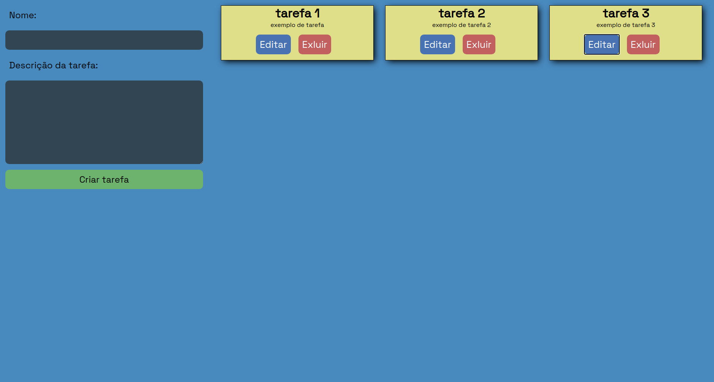
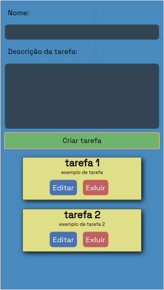

## React js task list

I did this project to train some concepts that I learned while reading the React documentation

## Getting Started

install dependencies: <b>npm run install</b> 

start project: <b>npm run start</b>

## Built With

* [ReactJs](https://pt-br.reactjs.org/)

## Images

## License

This project is licensed under the MIT License - see the [LICENSE.md](LICENSE.md) file for details

